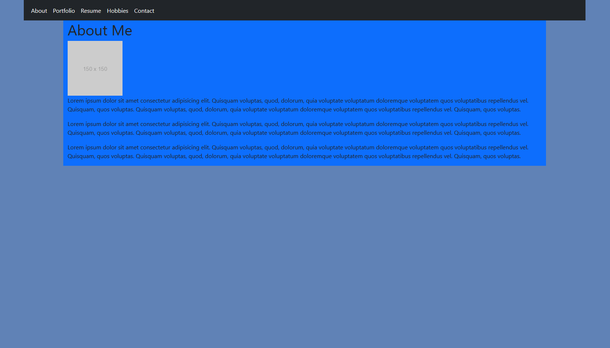

# React Based Portfolio

Creating a portfolio using React instead of the usual HTML, CSS, and JS.

## Description

This is a repeat of an older assignment but this time using React to write the page. It is currently very sparse and I will have to go over it with someone who can see colors to properly style it. It will have older projects, examples of hobbies and stuff I do outside of web development.

## Installation

This website is not a PWA so there is no need to download and install it. It is mainly for viewing purposes and will have a function to download a PDF copy of a resume once I get the backend linked to a database that can store such information.

The hosting site of this portfolio is subject to change as Heroku does not have a free option.

## User Story

```md
AS AN employer looking for candidates with experience building single-page applications
I WANT to view a potential employee's deployed React portfolio of work samples
SO THAT I can assess whether they're a good candidate for an open position
```

## Acceptance Criteria

```md
GIVEN a single-page application portfolio for a web developer
WHEN I load the portfolio
THEN I am presented with a page containing a header, a section for content, and a footer
WHEN I view the header
THEN I am presented with the developer's name and navigation with titles corresponding to different sections of the portfolio
WHEN I view the navigation titles
THEN I am presented with the titles About Me, Portfolio, Contact, and Resume, and the title corresponding to the current section is highlighted
WHEN I click on a navigation title
THEN the browser URL changes and I am presented with the corresponding section below the navigation and that title is highlighted
WHEN I load the portfolio the first time
THEN the About Me title and section are selected by default
WHEN I am presented with the About Me section
THEN I see a recent photo or avatar of the developer and a short bio about them
WHEN I am presented with the Portfolio section
THEN I see titled images of six of the developer’s applications with links to both the deployed applications and the corresponding GitHub repositories
WHEN I am presented with the Contact section
THEN I see a contact form with fields for a name, an email address, and a message
WHEN I move my cursor out of one of the form fields without entering text
THEN I receive a notification that this field is required
WHEN I enter text into the email address field
THEN I receive a notification if I have entered an invalid email address
WHEN I am presented with the Resume section
THEN I see a link to a downloadable resume and a list of the developer’s proficiencies
WHEN I view the footer
THEN I am presented with text or icon links to the developer’s GitHub and LinkedIn profiles, and their profile on a third platform (Stack Overflow, Twitter)
```

## Landing Page



## Credits

- Chelsea Wagner -https://github.com/caf62219
- Donnie Rowlings - https://github.com/drawlin22
- Colton Firestone - https://github.com/ColtonMakesStuff
- Nedda Elsayed - https://github.com/Lven-Nemsy

All these people have been very helpful and I am happy I will be able to stay in contact with them after this web development bootcamp is over.

## Links

- Link to Repo:  
  https://github.com/Kylyote/react-based-portfolio
- Link to Netlify
  https://main--papaya-marshmallow-59191e.netlify.app/
